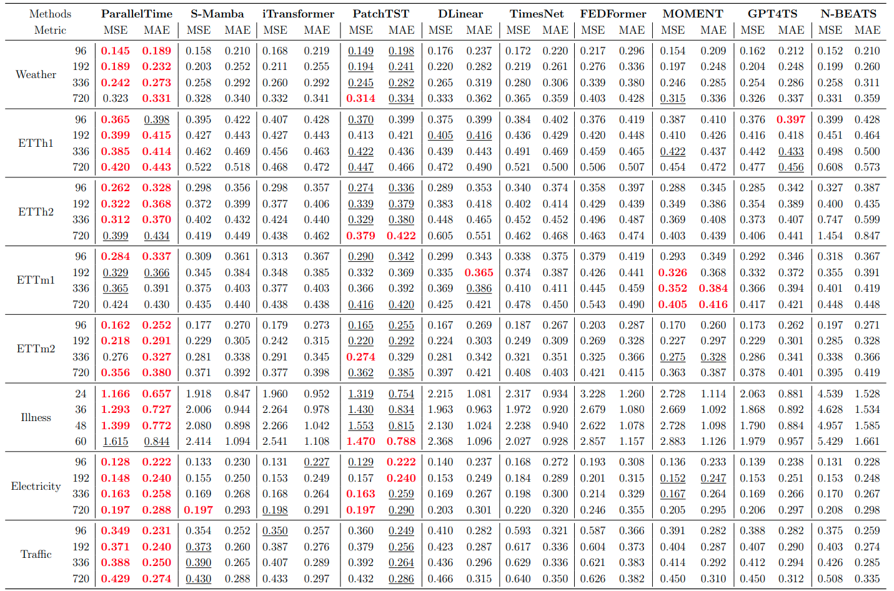

# <center>ParallelTime</center>

### Welcome to the official repository of: ParallelTime: Dynamically Weighting the Balance of Short- and Long-Term Temporal Dependencies. 
### The architecture of ParallelTime. 


### Our main contributions:
* ParallelTime selects the contributions of short-term, long-term, and global memory for each time series patch.
* We demonstrate that parallel Mamba-Attention architecture is currently the most effective
approach for long-term time series forecasting.
* Our model, ParallelTime, achieves SOTA performance on real-world benchmarks, delivering better results from previews models with fewer parameters and lower computational cost, critical for real-time forecasting.
## Results



## Usage

1. Obtain the fundamental long-term forecasting datasets, including Weather, Illness, Traffic, Electricity, and ETT (comprising 4 datasets)
You can do it by downloading it from this [Autoformer](https://drive.google.com/drive/folders/1ZOYpTUa82_jCcxIdTmyr0LXQfvaM9vIy), and move them into `dataset/` directory.
```
├── dataset
│   ├── electricity
│   │   └── electricity.csv
│   ├── ETT-small
│   │   ├── ETTh1.csv
│   │   ├── ETTh2.csv
│   │   ├── ETTm1.csv
│   │   └── ETTm2.csv
│   ├── illness
│   │   └── national_illness.csv
│   ├── traffic
│   │   └── traffic.csv
│   └── weather
│       └── weather.csv 
```


2. Install requirements. `pip uv` followed by `uv sync` which will install all the project dependencies (dont forget to change the source to .venv).

3. Look through our scripts located at ```./scripts``` which run 4 runs for diffrent prediction length depend on the dataset. You'll find the core of ParallelTime in ```models/ParallelTime.py```. For example, to get the multivariate forecasting results for ETTh1 dataset, just run the following command `sh ./scripts/etth1.sh`

For the other datasets run on a Linux machine:
```
sh ./scripts/electricity.sh
sh ./scripts/etth2.sh
sh ./scripts/ettm2.sh
sh ./scripts/traffic.sh
sh ./scripts/etth1.sh
sh ./scripts/ettm1.sh
sh ./scripts/illness.sh
sh ./scripts/weather.sh
```
After the run ends for each prediction length, you can open `./result_long_term_forecast_<dataset_name>.txt` to view the results once the model run is complete. Additionally, logs and configurations are saved for each run in ```./multirun/current_date/<dataset_name>/run_time```, which can be used to review more detailed results.


## Acknowledgement

We are deeply grateful for the valuable code and efforts contributed by the following GitHub repositories.
- https://github.com/thuml/iTransformer
- https://github.com/yuqinie98/PatchTST

## Contact
If you have any questions or concerns, please contact us or submit an issue